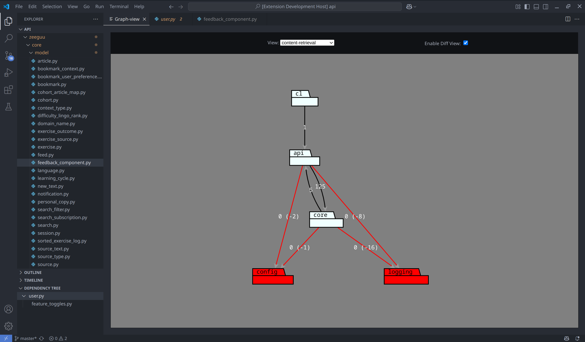
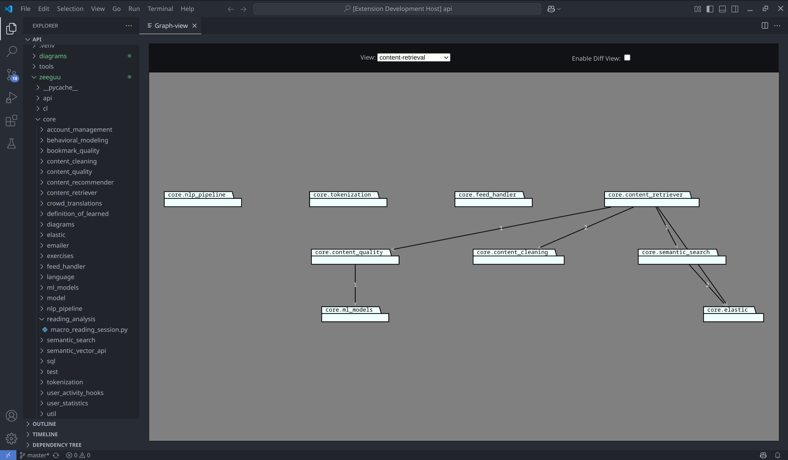
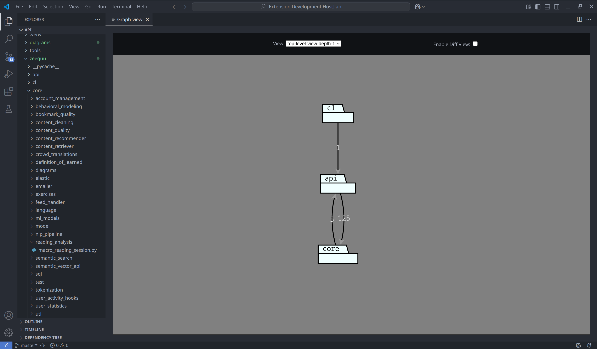

# ArchLens For VSCode
A Visual Studio Code extension that allows you to use ArchLens directly in your editor.





## ArchLens

ArchLens is included as a submodule in this repository. In this way, we can use the latest version of ArchLens to
develop the extension

### Setting up ArchLens

To be able to develop the extension, you need to have python installed. This python version should be compatible
with ArchLens. Refer to the [ArchLens](https://github.com/archlens/ArchLens/blob/master/README.md) 
documentation to read more.

### Publishing extension

Bundle the extension into a .vsix file

    vsce package

#### Installing extension

    --install-extension archlens-in-vscode-<version>.vsix

#### Set up Python environment

Set up your python virtual environment in ArchLens


```shell
cd ArchLens
python3 -m venv .venv
```

To start your virtual environment in linux use the command:

```shell

. .venv/bin/activate
```
To start your virtual environment in windows use the command:
```shell
cd .venv/Scripts && activate && cd ../../
```

#### Install dependencies

```shell

pip install -r requirements.txt
pip install -r dev-requirements.txt
```

If you do not have `setuptools` installed, you should install
this aswell

```shell

pip install setuptools
```

#### Setup development mode

```shell

python setup.py develop
```

Now you are ready to use ArchLens!

## VsCode Extension
The extension itself is divided into two modules:

### archlens-in-vscode
This is the backend part extension, setting up extension itself and handling the graph's datastructure and parsing.
After cloning the repository go to the `archlens-in-vscode` directory and use the command
```shell
npm install
```
to set up the npm-project.

 To run the extension make sure to compile the module first using
```shell
npm run compile
```

When the project is compiled you can run the extension by pressing `f5` in vscode. This will open a new instance of vscode where the extension is running.

### webview
This module is responsible for the webview itself. When making changes in the webview you don't need to restart the extension.